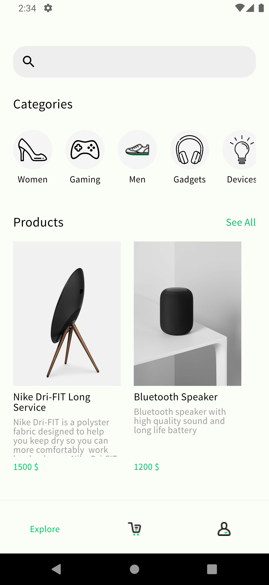
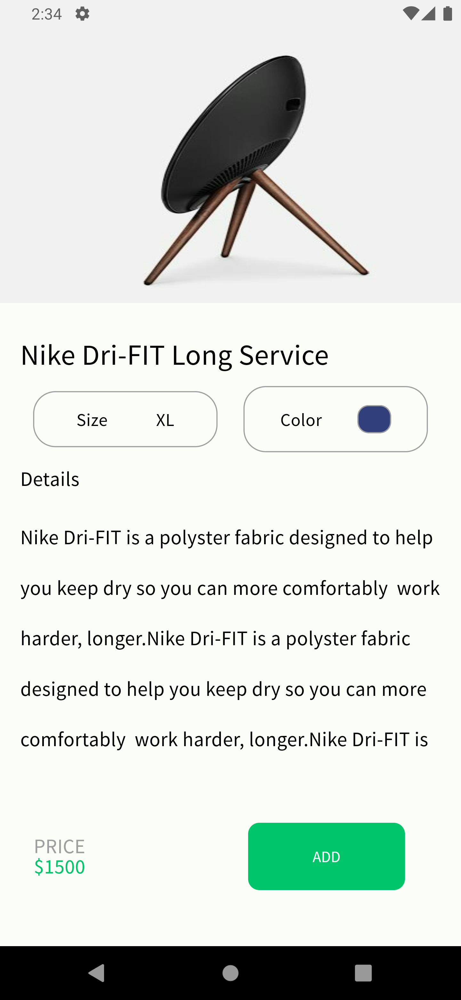
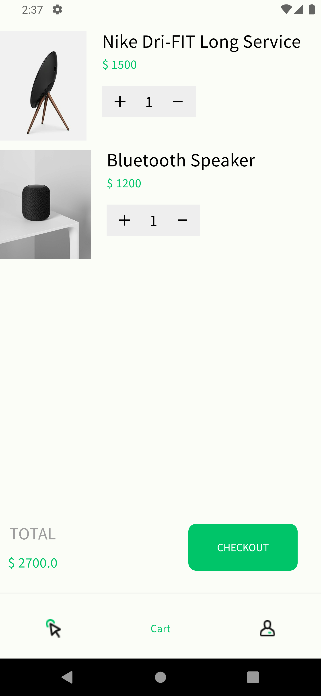
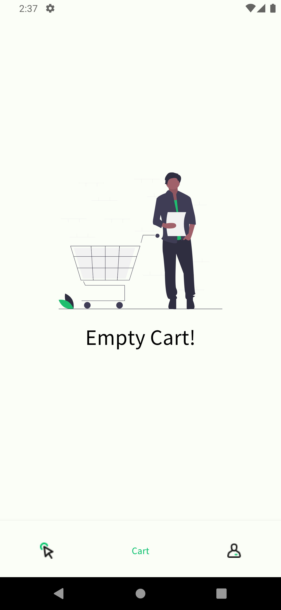
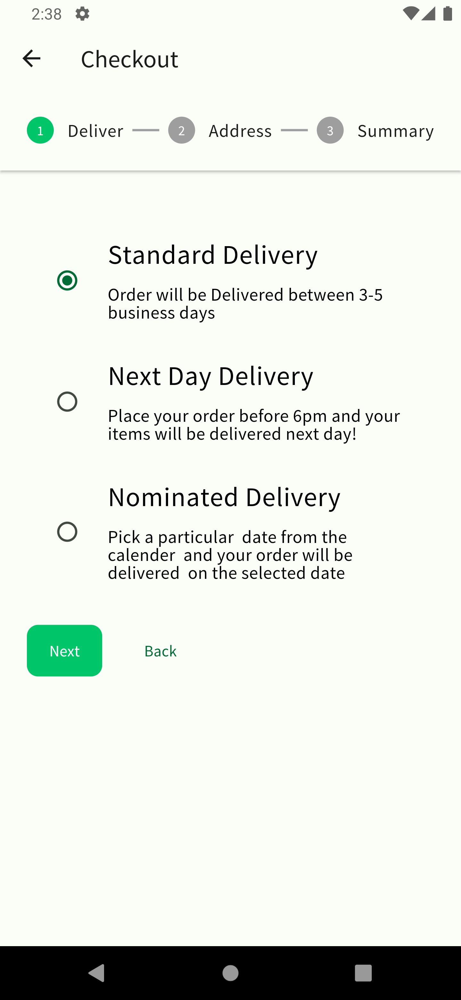
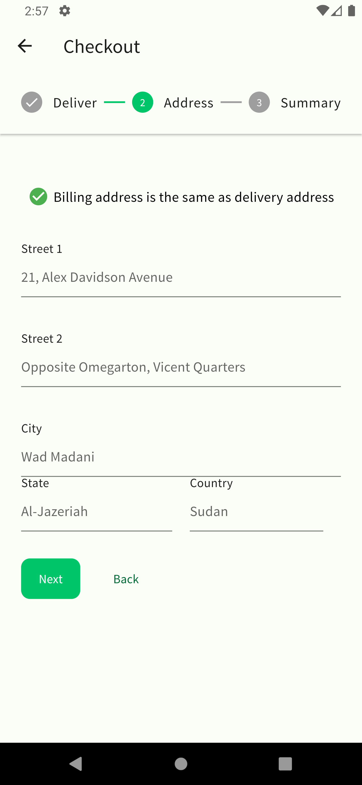
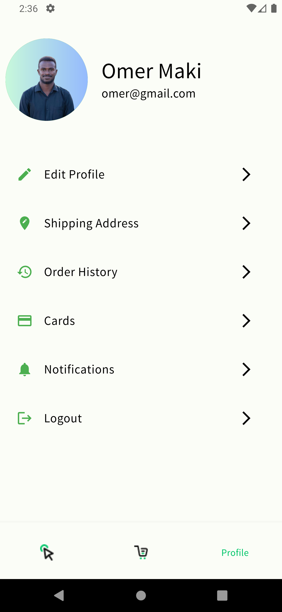

# Flutter E-Commerce App with Firebase

This Flutter application is a simple e-commerce app built to demonstrate my skills as a junior Flutter developer. The app allows users to browse products, add them to their cart, and proceed to checkout. Cart data is stored in a local storage using SQL.
## Table of Contents
- [Flutter E-Commerce App with Firebase](#flutter-e-commerce-app-with-firebase)
  - [Table of Contents](#table-of-contents)
  - [Features](#features)
  - [Technologies Used](#technologies-used)
  - [Screenshots](#screenshots)
  - [Installation and Setup](#installation-and-setup)
  - [Usage](#usage)
  - [Contributing](#contributing)
  - [License](#license)
    
## Features

- User authentication: Users can sign up, log in, and log out by either using email and password or by using Google or Facebook.
- Product Browsing: Users can browse products and view details.
- Shopping cart: Users can add products to their cart and adjust quantities, the products are saved locally in the device.
- Checkout: Users can proceed to checkout and place orders.
- Persistent cart: Cart data is stored in local storage, ensuring the persistence of the user's added products
- Responsive design: The app is designed to work seamlessly on both mobile and tablet devices.

## Technologies Used

- Flutter: A UI toolkit for building natively compiled applications for mobile, web, and desktop from a single codebase.
- Firebase Authentication: Provides easy-to-use authentication services.
- Firebase Firestore: A flexible, scalable database for mobile, web, and server development.
- Dart: The programming language used for Flutter app development.
- GetX: A lightweight, yet powerful state management solution for Flutter applications, providing reactive state management, dependency injection, and more.
## Screenshots
| home screen  | product details screen | 
|    :---:     |     :---:      | 
|  |  |
| cart screen | empty cart screen | 
|   |  |
| checkout delivery screen | checkout address screen | 
| |  |
| cart screen | - | 
| | 

## Installation and Setup

1. Clone the repository:
   ```bash
   git clone https://github.com/yourusername/your-repository.git
   ```

2. Navigate to the project directory:
   ```bash
    cd your-repository
    ```

3. Install dependencies:
   ```bash
   flutter pub get
   ```
4. Set up Firebase:
   * Create a new project in the Firebase Console.
   * Add an Android/iOS app to your Firebase project.
   * Follow the instructions to add Firebase to your Flutter app.
   * Enable Firebase Authentication and Firestore in the Firebase Console.
5. Run the app:
   ```bash
   flutter run
   ```

Usage
--------
* Sign up for a new account or log in with an existing account using email/password Google, or Facebook.
* Browse products and add them to your cart.
* Adjust quantities or remove items from your cart as needed.
* Proceed to checkout and place your order.
  
Contributing
------------
Contributions are welcome! Feel free to open issues or submit pull requests to contribute to this project.

License
-------
This project is licensed under the MIT License. See the [LICENSE](LICENSE) file for details.

